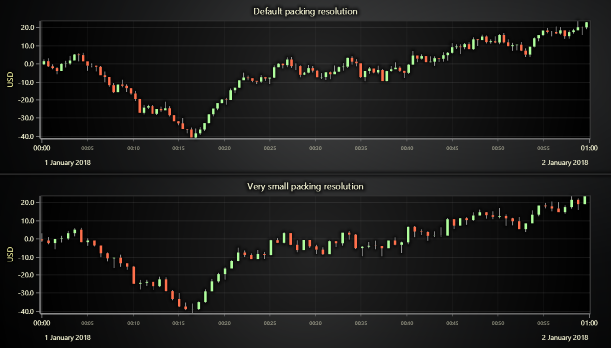
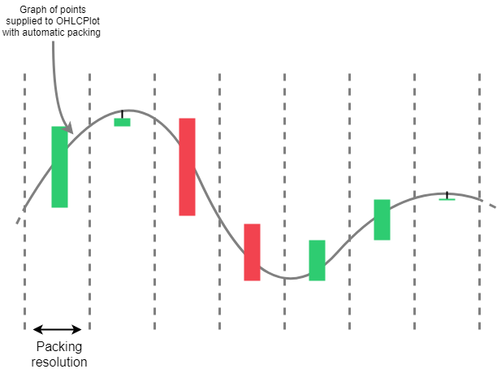

# JavaScript OHLC Chart with Automatic Packing Resolution

This demo application belongs to the set of examples for LightningChart JS, data visualization library for JavaScript.

LightningChart JS is entirely GPU accelerated and performance optimized charting library for presenting massive amounts of data. It offers an easy way of creating sophisticated and interactive charts and adding them to your website or web application.

The demo can be used as an example or a seed project. Local execution requires the following steps:

-   Make sure that relevant version of [Node.js](https://nodejs.org/en/download/) is installed
-   Open the project folder in a terminal:

          npm install              # fetches dependencies
          npm start                # builds an application and starts the development server

-   The application is available at _http://localhost:8080_ in your browser, webpack-dev-server provides hot reload functionality.

## Description

The examples purpose is to shed some light on the packing logic of OHLCSeriesWithAutomaticPacking and how it can be fit to users needs by usage of method: `setPackingResolution`.

This class is a variant of OHLCSeries, which adds the automatic packing of XY-points to XOHLC-points. In a nutshell, when pushing points, it simply packages these points into 'XOHLC'-objects at certain intervals (which is controlled by the packing resolution property).

By default, or if packing resolution is explicitly set to 'undefined', the used value will be automatically computed based on current pixel-size. This effectively means that any newly pushed points will never be able to be zoomed closer than the view at the time of packing.

To ensure that the figures can be zoomed up to desired details, users can set an explicit value for the packing resolution, which will specify the minimum interval (in axis values) between two fully zoomed figures.

[//]: # 'IMPORTANT: The assets will not show before README.md is built - relative path is different!'

## API Links

* [Axis tick strategies]
* [XY cartesian chart]
* [OHLC series types]
* [Series with automatic packing]
* [Progressive trace generator]

## Support

If you notice an error in the example code, please open an issue on [GitHub][0] repository of the entire example.

Official [API documentation][1] can be found on [LightningChart][2] website.

If the docs and other materials do not solve your problem as well as implementation help is needed, ask on [StackOverflow][3] (tagged lightningchart).

If you think you found a bug in the LightningChart JavaScript library, please contact support@lightningchart.com.

Direct developer email support can be purchased through a [Support Plan][4] or by contacting sales@lightningchart.com.

[0]: https://github.com/Arction/
[1]: https://lightningchart.com/lightningchart-js-api-documentation/
[2]: https://lightningchart.com
[3]: https://stackoverflow.com/questions/tagged/lightningchart
[4]: https://lightningchart.com/support-services/

© LightningChart Ltd 2009-2022. All rights reserved.

[Axis tick strategies]: https://lightningchart.com/js-charts/api-documentation/v5.0.1/variables/AxisTickStrategies.html
[XY cartesian chart]: https://lightningchart.com/js-charts/api-documentation/v5.0.1/classes/ChartXY.html
[OHLC series types]: https://lightningchart.com/js-charts/api-documentation/v5.0.1/variables/OHLCSeriesTypes.html
[Series with automatic packing]: https://lightningchart.com/js-charts/api-documentation/v5.0.1/classes/OHLCSeriesWithAutomaticPacking.html
[Progressive trace generator]: https://arction.github.io/xydata/classes/progressivetracegenerator.html

